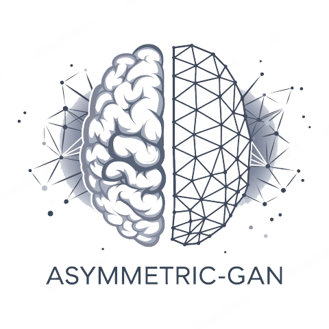
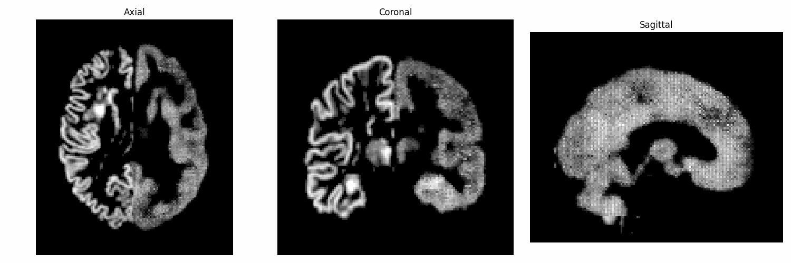

<div align="center">
<a href="https://github.com/mqqq333/LorewormGu" target="blank">

</a>

<h2> Asymmetric-GAN: Hemispheric-Specific Brain Modeling and Analysis Based on Generative Adversarial Networks </h2>

    



</div>

## 💡 Overview

**Asymmetric-GAN** is a cutting-edge project focused on the study of **brain hemisphere asymmetry** and its impact on cognitive functions. The project utilizes **Generative Adversarial Networks (GANs)** to model and analyze the interaction between the left and right hemispheres of the brain. By reconstructing one hemisphere using the data from the opposite hemisphere, the aim is to uncover shared and unique functional regions between the hemispheres, contributing new insights into the study of **hemispheric lateralization**.

This research explores the global structural relationships of the brain's hemispheres, breaking away from traditional methods that rely solely on homotopic cortical region comparisons. By leveraging **GANs**, the project enhances our understanding of brain hemisphere specialization, introducing a concept known as **global hemispheric specificity**.

The model evaluation uses two key metrics—**absolute voxel distance (ANS)** and **relative voxel distance (RNS)**—to assess the hemispheric asymmetry, validated through **reliability and validity testing** to ensure biological accuracy. This project offers new perspectives on hemispheric lateralization and opens doors for future cognitive neuroscience research.
## ✨ Features

- **🧠 GAN-Based Modeling**: Uses **GANs** to reconstruct one hemisphere from the other, analyzing brain hemisphere asymmetry and interactions.
- **💡 Global Hemispheric Specificity**: Captures **global structural relationships** between hemispheres, offering a deeper understanding of brain function lateralization.
- **⚙️ Deep Neural Network Framework**: A **deep neural network** under GAN architecture to model complex hemispheric interactions.
- **🔬 Evaluation with ANS and RNS**: Assesses hemispheric asymmetry using **Absolute Voxel Distance (ANS)** and **Relative Voxel Distance (RNS)**.
- **📊 Reliability Testing**: Validates the model’s **biological accuracy** through comprehensive testing against real brain data.

Whether you're an emerging cognitive neuroscience researcher or an experienced AI professional, **Asymmetric-GAN** is the ideal project for exploring advanced brain hemisphere modeling and hemispheric asymmetry analysis. 🌟 You’ll gain insights into both the theoretical aspects and practical applications of GAN-based models, laying a strong foundation for further research in cognitive neuroscience and AI-driven brain studies.
## 👩‍💻 Tech Stack

- **PyTorch**: Framework for building and training the **GAN-based model** for brain hemisphere analysis.
- **FSL (FMRIB Software Library)**: Used for preprocessing neuroimaging data, including brain extraction and motion correction.
- **WandB**: Tool for tracking experiments, visualizing metrics, and ensuring reproducibility during model training.

## 📦 Getting Started

To get a local copy of **Asymmetric-GAN** up and running, follow these steps.

### 🚀 Prerequisites

- **Python** (v3.8 or higher) and **pip** (or **conda** for package management).
- **PyTorch**
- **CUDA** (for GPU acceleration, recommended for faster model training).
-  **FSL (FMRIB Software Library)**
## 🛠️ Installation

1. **Clone the repository:**
   ```bash
	git clone https://github.com/mqqq333/Asymmetric-GAN.git
	cd Asymmetric-GAN
   ```
2. **Install necessary libraries**
   ```bash
	pip install 
   ```
3. **Start training**
   ```bash
	python run.py
   ```
4. **Run inference**
   ```bash
	python eval_model.py
```
## ⚙️Preprocess

- Skull Stripping (BET)
- Tissue Segmentation (FAST)
- Spatial Normalization (FLIRT)
- Grey Matter Masking (fslmaths)
- (Optional) Hemisphere Processing
Please refer to `process_single_subject.sh`. You can accelerate the process using GNU Parallel during execution.
## 🤝 Contributing

We welcome contributions to **Asymmetric-GAN**! If you'd like to contribute, please follow the steps below:
1. **Fork the repository.**
2. **Create a new branch** (`git checkout -b feature/your-feature-name`).
3. **Make your changes** and commit them (`git commit -m 'Add some feature'`).
4. **Push to the branch** (`git push origin feature/your-feature-name`).
5. **Open a pull request**.


## 🐛 Issues

If you encounter any issues while using or setting up the project, please check the [Issues]() section to see if it has already been reported. If not, feel free to open a new issue detailing the problem.

When reporting an issue, please include:

- A clear and descriptive title.
- A detailed description of the problem.
- Steps to reproduce the issue.
- Any relevant logs or screenshots.
- The environment in which the issue occurs (OS, browser, Python version, etc.).

## 📜 License

Distributed under the MIT License. See [License](/LICENSE) for more information.